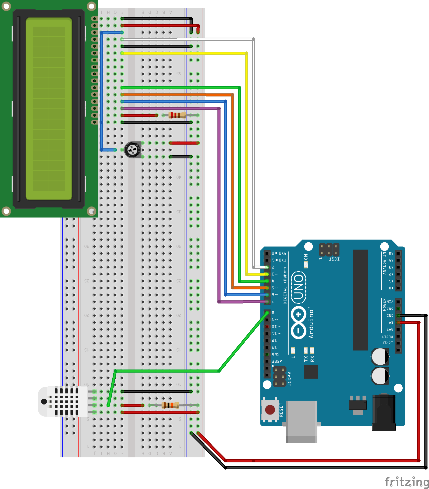

# Arduino DHT22 Temperature and Humidity

This Arduino sketch makes use of the DHT22 temperature and humidity sensor and an LCD to display the temperature, humidity, and heat index.

## Materials

- Arduino Uno
- DHT22
- 220 ohm resistor
- 10k ohm resistor
- 10k ohm potentiometer
- Hitachi HD44780 compatible liquid crystal display

## Wiring

## Sketch

[DHT_LCD.ino](DHT_LCD.ino)
